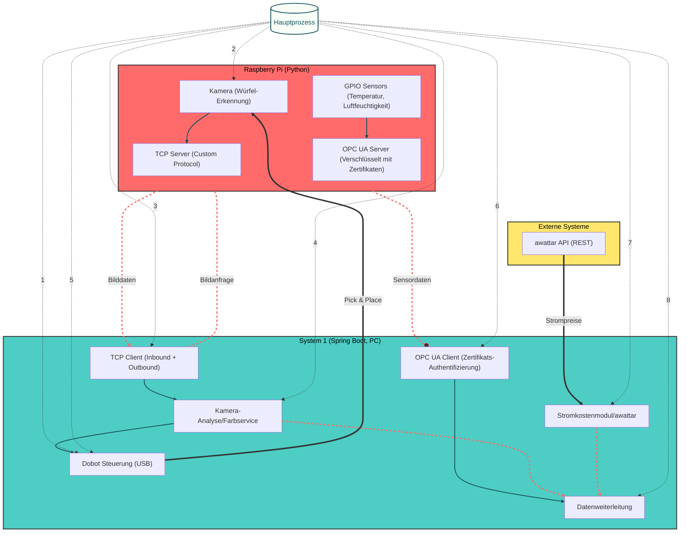
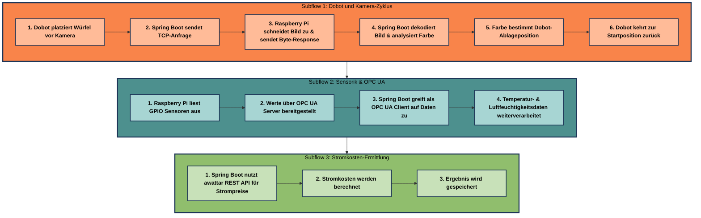
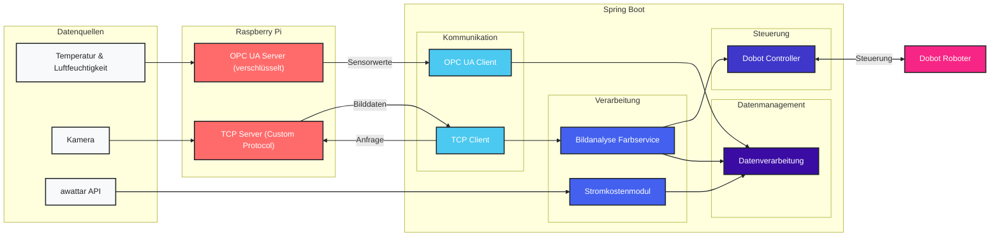

📄 02_Systemarchitektur.md
==========================

🏗️ Systemarchitektur
----------------------------------------------------------------------

Dieses Kapitel beschreibt die **Systemarchitektur** des Projekts "Die Macher". Es zeigt die Komponenten, deren Zusammenspiel und die Datenflüsse zwischen den verschiedenen Systemen. Die Architektur ist modular aufgebaut und folgt dem Prinzip der Trennung von Zuständigkeiten.

🧩 Gesamtübersicht
-----------------

🔄 Hauptprozesse
-----------------

📊 Datenflüsse
--------------

📱 Komponenten im Detail
-----------------------

### 🔴 Raspberry Pi (Python)

* **GPIO-Platine**
  * Sensoren für Temperatur und Luftfeuchtigkeit
  * Datenübermittlung über OPC UA Server
  * Verschlüsselte Kommunikation mit Zertifikaten

* **Kamera**
  * Erkennung farbiger Würfel
  * Zugeschnittene Bilder des Würfels (zentraler Bildausschnitt)
  * Reagiert auf TCP-Anfragen von System 1
  * Sendet Byte-Array (Bilddaten) im Custom Protocol Format
  * Agiert als TCP-Server

### 🔵 System 1 (Spring Boot, PC)

* **TCP-Client (Inbound + Outbound)**
  * Empfängt Nachrichten vom Raspberry Pi
  * Stellt gezielte Bildanfragen an den Raspberry Pi
  * Verarbeitet Byte-Response mit Custom Header

* **Kamera-Analyse / Farbservice**
  * Wandelt Byte-Response in Bild um
  * Extrahiert dominante Farbe (Rot, Grün, Gelb, Blau)
  * Übergibt Farbinformation an die Sortierlogik

* **Dobot Steuerung (USB)**
  * Pick-and-Place Prozess:
    * Greift Würfel an fester Position
    * Platziert ihn vor Kamera
    * Sortiert nach Farbklassifikation
    * Kehrt zur Ausgangsposition zurück

* **OPC UA Client**
  * Verbindung zum OPC UA Server auf dem Raspberry Pi
  * Zertifikats-basierte Authentifizierung
  * Empfängt Temperatur- & Feuchtigkeitsdaten

* **Stromkostenmodul / awattar**
  * Abruf von Strompreisdaten über REST API
  * Berechnung der Stromkosten
  * Weiterleitung der Ergebnisse an System 2

* **Datenweiterleitung**
  * Übermittlung aller relevanten Daten an System 2 via TCP

### 🟢 Externe Systeme

* **awattar API (REST)**
  * Liefert aktuelle Strompreise
  * Basis für Stromkostenberechnung

📎 Verknüpfte Kapitel
---------------------

* [01_Projektübersicht.md](01_Projektübersicht.md)
* [03_Datenfluss_und_Kommunikation.md](03_Datenfluss_und_Kommunikation.md)
* [04_Komponenten_System1.md](04_Komponenten_System1.md)