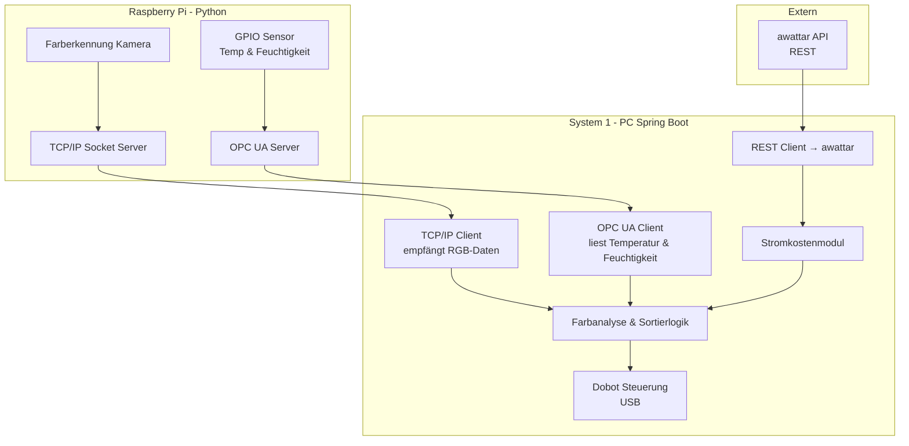

📄 02_Systemarchitektur.md
==========================

🔧 Systemübersicht
----------------

Die Systemarchitektur unseres Industrie 4.0-Projekts besteht aus drei Hauptkomponenten, die über verschiedene Kommunikationsprotokolle miteinander verbunden sind. Das System demonstriert moderne industrielle Kommunikationsstandards und ermöglicht eine durchgängige Datenkette von der Sensorik bis zur Visualisierung.

📊 Systemkomponenten-Flow
------------------------

🔍 Hauptkomponenten
-----------------

### 1. Raspberry Pi (Python)
- **Sensordatenerfassung:** Temperatur- und Feuchtigkeitsmessung über GPIO
- **Bildverarbeitung:** Farberkennung mittels Kamera
- **Kommunikation:** OPC UA Server für Sensordaten, TCP/IP Socket Server für Bilddaten

### 2. System 1 - PC (Spring Boot)
- **Datenempfang:** OPC UA Client und TCP/IP Client
- **Verarbeitung:** Farbanalyse und Sortierlogik
- **Steuerung:** Dobot-Roboter via USB
- **Energiemanagement:** Stromkostenberechnung mit aWATTar-Integration

### 3. Externe Systeme
- **aWATTar API:** REST-Schnittstelle für Energiepreisdaten

🔌 Kommunikationsprotokolle
-------------------------

- **OPC UA:** Industriestandard für Sensordatenübertragung
- **TCP/IP:** Netzwerkkommunikation für Bilddaten
- **REST:** HTTP-basierte API-Kommunikation
- **USB:** Direkte Hardwaresteuerung des Roboters

📎 Verknüpfte Kapitel
---------------------

- [03_Datenfluss_und_Kommunikation.md](03_Datenfluss_und_Kommunikation.md)
- [04_Softwarekomponenten_System1.md](04_Softwarekomponenten_System1.md)
- [08_MQTT_Nachrichtenmodell.md](08_MQTT_Nachrichtenmodell.md)