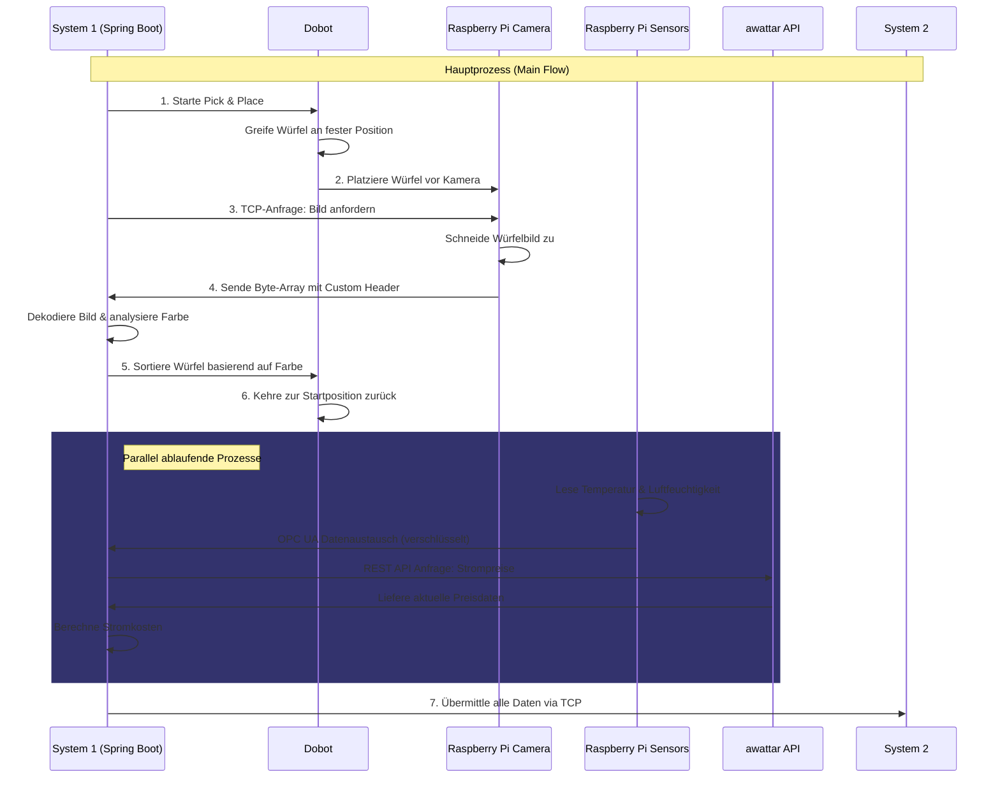
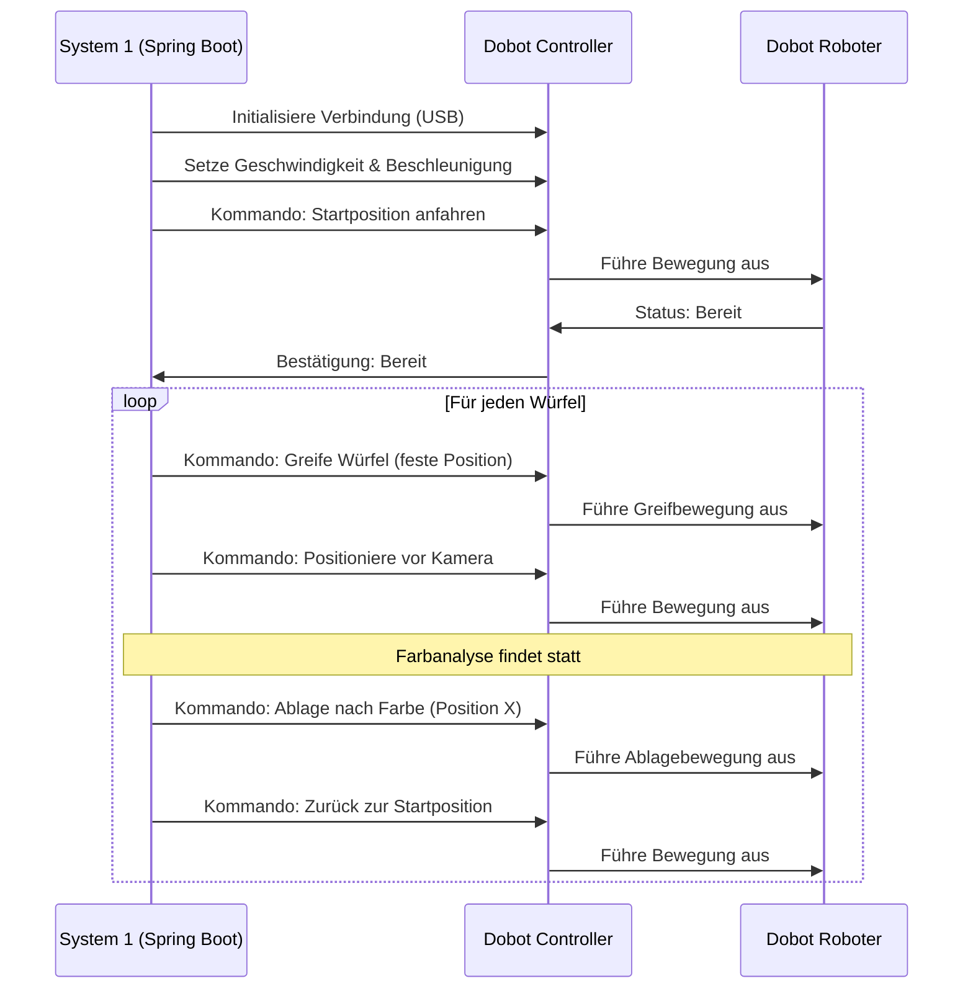

# Datenfluss und Kommunikation

## Einleitung

Dieses Kapitel beschreibt die Kommunikationswege und Datenflüsse zwischen den verschiedenen Komponenten des Projekts "Die Macher". Es zeigt die Interaktionen zwischen Raspberry Pi, System 1 (Spring Boot) und externen Systemen sowie die verwendeten Protokolle und Datenformate.

## Hauptprozess (Main Flow)

## Kommunikationsprotokolle

### TCP/IP Kommunikation (Raspberry Pi ↔ System 1)

#### Eigenschaften
- **Richtung:** Bidirektional
- **Initiator:** System 1 (Spring Boot)
- **Responder:** Raspberry Pi (TCP-Server)
- **Datenformat:** Byte-Array mit Custom Header
- **Inhalt:** Zugeschnittenes Bild des Würfels

#### Ablauf
1. System 1 sendet Bildanfrage
2. Raspberry Pi verarbeitet Anfrage
3. Raspberry Pi sendet Bilddaten zurück
4. System 1 verarbeitet empfangene Daten

### OPC UA Kommunikation (Raspberry Pi → System 1)

#### Eigenschaften
- **Richtung:** Unidirektional (Sensordaten)
- **Sicherheit:** Verschlüsselt mit Zertifikaten
- **Authentifizierung:** Zertifikatsbasiert

#### Datenübertragung
- **Datentypen:**
  - Temperatur (°C)
  - Luftfeuchtigkeit (%)
- **Aktualisierungsrate:** Regelmäßige Übertragung

### REST API Kommunikation (System 1 ↔ awattar)

#### Eigenschaften
- **Richtung:** Request-Response
- **Datenformat:** JSON
- **Protokoll:** HTTPS

#### Parameter
- **Anfrage:**
  - Zeitraum
  - Region
- **Antwort:**
  - Strompreise (€/kWh)
  - Zeitstempel

### Datenweiterleitung (System 1 → System 2)

#### Technische Details
- **Protokoll:** TCP
- **Datenformat:** Strukturierte Daten

#### Übertragene Daten
- Farbklassifikation der Würfel
- Temperatur- und Luftfeuchtigkeitswerte
- Berechnete Stromkosten
- Prozessstatistiken

## Dobot Steuerung

## FAQ

**F: Wie wird die Datensicherheit bei der Kommunikation gewährleistet?**
A: Durch verschlüsselte Verbindungen (OPC UA mit Zertifikaten, HTTPS für REST) und sichere Authentifizierung.

**F: Was passiert bei Kommunikationsfehlern?**
A: Implementierte Fehlerbehandlung mit automatischen Wiederverbindungsversuchen und Logging.

## Weiterführende Dokumentation

- [Systemarchitektur](02_Systemarchitektur.md)
- [Komponenten System 1](04_Komponenten_System1.md)
- [System 2 Setup](05_System2_Architektur_und_Setup.md)

## Änderungshistorie

| Datum | Version | Änderungen | Autor |
|-------|----------|------------|--------|
| 2024-05 | 1.0 | Initiale Dokumentation der Kommunikationswege | Team |
| 2024-06 | 1.1 | Ergänzung Fehlerbehandlung | Team |
