📄 03_Datenfluss_und_Kommunikation.md
==========================

🔄 Datenfluss und Kommunikation
----------------------------------------------------------------------

Dieses Kapitel beschreibt die **Kommunikationswege** und **Datenflüsse** zwischen den verschiedenen Komponenten des Projekts "Die Macher". Es zeigt die Interaktionen zwischen Raspberry Pi, System 1 (Spring Boot) und externen Systemen sowie die verwendeten Protokolle und Datenformate.

🔄 Hauptprozess (Main Flow)
--------------------------

```mermaid
sequenceDiagram
    participant SB as System 1 (Spring Boot)
    participant DB as Dobot
    participant RPI_C as Raspberry Pi Camera
    participant RPI_S as Raspberry Pi Sensors
    participant AW as awattar API
    participant S2 as System 2

    Note over SB,S2: Hauptprozess (Main Flow)
    
    SB->>DB: 1. Starte Pick & Place
    DB->>DB: Greife Würfel an fester Position
    DB->>RPI_C: 2. Platziere Würfel vor Kamera
    SB->>RPI_C: 3. TCP-Anfrage: Bild anfordern
    RPI_C->>RPI_C: Schneide Würfelbild zu
    RPI_C->>SB: 4. Sende Byte-Array mit Custom Header
    SB->>SB: Dekodiere Bild & analysiere Farbe
    SB->>DB: 5. Sortiere Würfel basierend auf Farbe
    DB->>DB: 6. Kehre zur Startposition zurück

    rect rgb(51, 51, 109)
    Note right of SB: Parallel ablaufende Prozesse
    RPI_S->>RPI_S: Lese Temperatur & Luftfeuchtigkeit
    RPI_S->>SB: OPC UA Datenaustausch (verschlüsselt)
    SB->>AW: REST API Anfrage: Strompreise
    AW->>SB: Liefere aktuelle Preisdaten
    SB->>SB: Berechne Stromkosten
    end

    SB->>S2: 7. Übermittle alle Daten via TCP
```

📡 Kommunikationsprotokolle im Detail
----------------------------------

### 🔌 TCP/IP Kommunikation (Raspberry Pi ↔ System 1)

* **Richtung:** Bidirektional
* **Initiator:** System 1 (Spring Boot) sendet Anfrage
* **Responder:** Raspberry Pi (TCP-Client) antwortet
* **Datenformat:** Byte-Array mit Custom Header
* **Inhalt:** Zugeschnittenes Bild des Würfels
* **Besonderheit:** Raspberry Pi agiert als TCP-Client, nicht als Server

### 🔐 OPC UA Kommunikation (Raspberry Pi → System 1)

* **Richtung:** Unidirektional (Sensordaten)
* **Sicherheit:** Verschlüsselt mit Zertifikaten
* **Authentifizierung:** Zertifikatsbasiert
* **Datentypen:** Temperatur (°C), Luftfeuchtigkeit (%)
* **Aktualisierungsrate:** Regelmäßige Übertragung

### 🌐 REST API Kommunikation (System 1 ↔ awattar)

* **Richtung:** Request-Response
* **Datenformat:** JSON
* **Abfrageparameter:** Zeitraum, Region
* **Rückgabewerte:** Strompreise (€/kWh)
* **Verwendung:** Berechnung der Stromkosten

### 📊 Datenweiterleitung (System 1 → System 2)

* **Protokoll:** TCP
* **Datenformat:** Strukturierte Daten
* **Inhalte:**
  * Farbklassifikation der Würfel
  * Temperatur- und Luftfeuchtigkeitswerte
  * Berechnete Stromkosten
  * Prozessstatistiken

🤖 Dobot Steuerung
----------------

```mermaid
sequenceDiagram
    participant SB as System 1 (Spring Boot)
    participant DB as Dobot Controller
    participant Robot as Dobot Roboter

    SB->>DB: Initialisiere Verbindung (USB)
    SB->>DB: Setze Geschwindigkeit & Beschleunigung
    SB->>DB: Kommando: Startposition anfahren
    DB->>Robot: Führe Bewegung aus
    Robot->>DB: Status: Bereit
    DB->>SB: Bestätigung: Bereit
    
    loop Für jeden Würfel
        SB->>DB: Kommando: Greife Würfel (feste Position)
        DB->>Robot: Führe Greifbewegung aus
        SB->>DB: Kommando: Positioniere vor Kamera
        DB->>Robot: Führe Bewegung aus
        Note over SB,Robot: Farbanalyse findet statt
        SB->>DB: Kommando: Ablage nach Farbe (Position X)
        DB->>Robot: Führe Ablagebewegung aus
        SB->>DB: Kommando: Zurück zur Startposition
        DB->>Robot: Führe Bewegung aus
    end
```

📎 Verknüpfte Kapitel
---------------------

* [02_Systemarchitektur.md](02_Systemarchitektur.md)
* [04_Komponenten_und_System1.md](04_Komponenten_und_Module.md)
* [05_System2_Architektur_und_Setup.md](05_System2_Architektur_und_Setup.md)