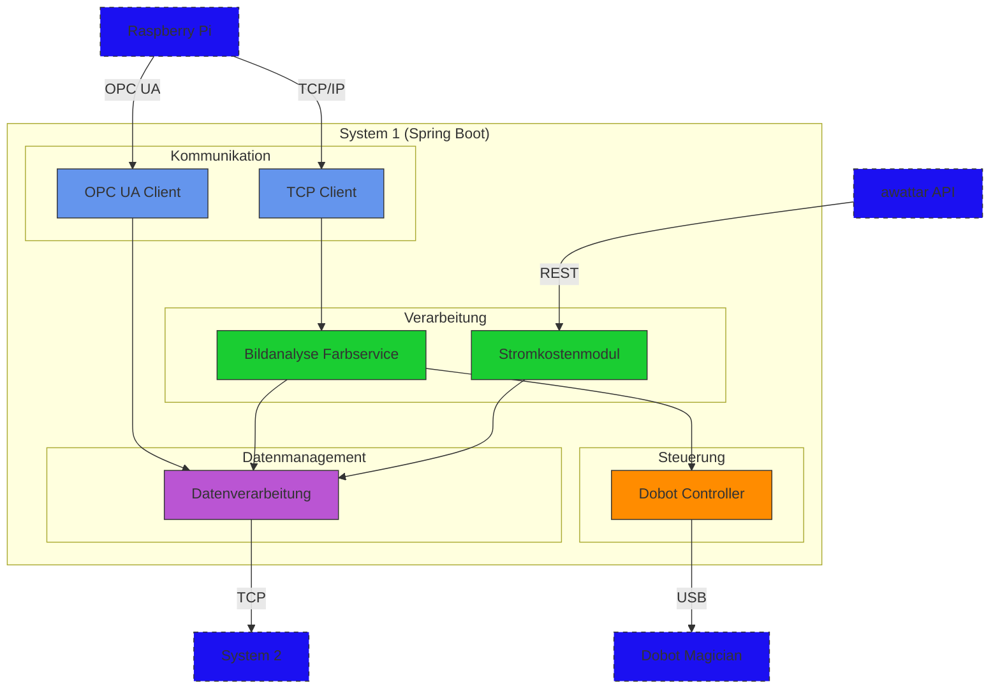

# Komponenten des System 1 (Spring Boot)

## Einleitung

Dieses Kapitel beschreibt die **Hauptkomponenten** des System 1, das auf **Spring Boot** basiert und auf einem PC läuft. Es bildet das zentrale Steuerungssystem des Projekts "Die Macher" und verbindet den Raspberry Pi, den Dobot Roboter und externe Dienste.

### Verwendungszweck

System 1 dient als zentrale Steuerungseinheit für:
- Bildverarbeitung und Farbanalyse
- Robotersteuerung und Koordination
- Datenerfassung und -weiterleitung
- Kostenoptimierung und Überwachung

### Voraussetzungen

- Java Development Kit (JDK) 17 oder höher
- Maven als Build-Tool
- USB-Anschluss für Dobot-Verbindung
- Netzwerkverbindung für API-Zugriffe

## Architekturübersicht

## TCP-Client (Inbound + Outbound)

Der TCP-Client ist für die bidirektionale Kommunikation mit dem Raspberry Pi verantwortlich.

### Funktionalität

#### Empfang von Bilddaten
- Verarbeitet eingehende Byte-Arrays mit Custom Header
- Dekodiert die Bilddaten für die weitere Verarbeitung
- Leitet Daten an den Bildanalyse-Service weiter

#### Anfrage von Bildern
- Sendet gezielte Anfragen an den Raspberry Pi
- Definiert Parameter für die Bildaufnahme
- Implementiert Timeout-Handling und Wiederholungslogik

### Fehlerbehandlung
- Automatische Wiederverbindung bei Verbindungsabbrüchen
- Logging von Übertragungsfehlern
- Benachrichtigung bei kritischen Fehlern

## Kamera-Analyse / Farbservice

Der Bildanalyse-Service verarbeitet die vom TCP-Client empfangenen Bilddaten und extrahiert die dominante Farbe.

### Funktionalität

#### Bildverarbeitung
- Konvertiert Byte-Arrays in Bildformate
- Wendet Filter und Bildverbesserungen an
- Extrahiert den relevanten Bildbereich (Würfel)

#### Farbklassifikation
- Identifiziert die dominante Farbe (Rot, Grün, Gelb, Blau)
- Verwendet HSV-Farbmodell für robuste Erkennung
- Liefert Farbinformation an die Sortierlogik

### Konfiguration
- Anpassbare Schwellenwerte für Farberkennung
- Kalibrierungsmöglichkeiten für verschiedene Lichtverhältnisse
- Einstellbare Bildverarbeitungsparameter

## Dobot Steuerung (USB)

Die Dobot-Steuerung ermöglicht die präzise Kontrolle des Roboterarms über eine USB-Verbindung.

### Funktionalität

#### Initialisierung und Konfiguration
- Aufbau der USB-Verbindung zum Dobot Magician
- Konfiguration von Geschwindigkeit und Beschleunigung
- Kalibrierung und Referenzfahrt

#### Pick-and-Place Prozess
- Greift Würfel an fester Position
- Platziert ihn vor der Kamera zur Analyse
- Sortiert nach Farbklassifikation in entsprechende Behälter
- Kehrt zur Ausgangsposition zurück

### Sicherheit und Fehlerbehandlung
- Kollisionserkennung und -vermeidung
- Wiederherstellung nach Verbindungsabbrüchen
- Notfall-Stopp-Funktionalität
- Überwachung der Motortemperaturen

## OPC UA Client

Der OPC UA Client stellt eine sichere Verbindung zum OPC UA Server auf dem Raspberry Pi her.

### Funktionalität

#### Sichere Verbindung
- Zertifikatsbasierte Authentifizierung
- Verschlüsselte Kommunikation
- Automatische Wiederverbindung bei Unterbrechungen

#### Datenabruf
- Abonnement von Temperatur- und Feuchtigkeitsdaten
- Regelmäßige Aktualisierung der Werte
- Validierung und Plausibilitätsprüfung

### Monitoring
- Überwachung der Verbindungsqualität
- Protokollierung von Verbindungsereignissen
- Alarmierung bei Verbindungsabbrüchen

## Stromkostenmodul / awattar

Das Stromkostenmodul ruft aktuelle Strompreisdaten von der aWATTar API ab und berechnet die Stromkosten.

### Funktionalität

#### Datenabruf
- Regelmäßige Abfrage der aWATTar REST API
- Verarbeitung der JSON-Antwort
- Caching der Preisdaten

#### Kostenberechnung
- Berechnung der aktuellen Stromkosten
- Prognose für zukünftige Kosten
- Optimierung des Energieverbrauchs

### Konfiguration
- API-Zugangsdaten und Endpunkte
- Aktualisierungsintervalle
- Schwellenwerte für Kostenalarme

## Datenweiterleitung

Die Datenweiterleitung sammelt alle relevanten Daten und übermittelt sie an System 2.

### Funktionalität

#### Datensammlung
- Aggregation von Daten aus verschiedenen Quellen
- Formatierung und Strukturierung der Daten
- Zwischenspeicherung bei Verbindungsproblemen

#### Datenübertragung
- TCP-basierte Kommunikation mit System 2
- Fehlerbehandlung und Wiederholungslogik
- Bestätigung der erfolgreichen Übertragung

### Performance
- Optimierte Datenaggregation
- Effiziente Speichernutzung
- Lastabhängige Übertragungssteuerung

## Zusammenfassung

### Hauptkomponenten
System 1 bildet das zentrale Steuerungssystem des Projekts "Die Macher" und integriert folgende Komponenten:

- **TCP-Client**
  - Bidirektionale Kommunikation mit dem Raspberry Pi
  - Zuverlässige Bildübertragung

- **Bildanalyse**
  - Verarbeitung und Farbklassifikation von Würfelbildern
  - Robuste Farberkennung mittels HSV-Farbmodell

- **Dobot-Steuerung**
  - Präzise Kontrolle des Roboterarms für Pick-and-Place
  - Integrierte Sicherheitsfunktionen

- **OPC UA Client**
  - Sichere Kommunikation mit dem Raspberry Pi
  - Erfassung von Umgebungsdaten

- **Stromkostenmodul**
  - Abruf und Berechnung von Strompreisdaten
  - Energieoptimierung

- **Datenweiterleitung**
  - Zuverlässige Übermittlung aller Daten an System 2
  - Performante Datenaggregation

### Systemintegration
Die Integration dieser Komponenten ermöglicht:
- Vollautomatische Würfelsortierung nach Farben
- Kontinuierliche Umgebungsüberwachung
- Energieeffiziente Prozesssteuerung
- Zentrales Monitoring aller Systemzustände

## Verknüpfte Kapitel

### Weiterführende Dokumentation
- [01_Projektübersicht.md](01_Projektübersicht.md)
- [02_Systemarchitektur.md](02_Systemarchitektur.md)
- [03_Datenfluss_und_Kommunikation.md](03_Datenfluss_und_Kommunikation.md)

## Änderungshistorie

| Datum | Version | Änderungen | Autor |
|-------|----------|------------|--------|
| 2024-05 | 1.0 | Initiale Dokumentation | Team |
| 2024-06 | 1.1 | Genauere Definition von System 1 | Team |
